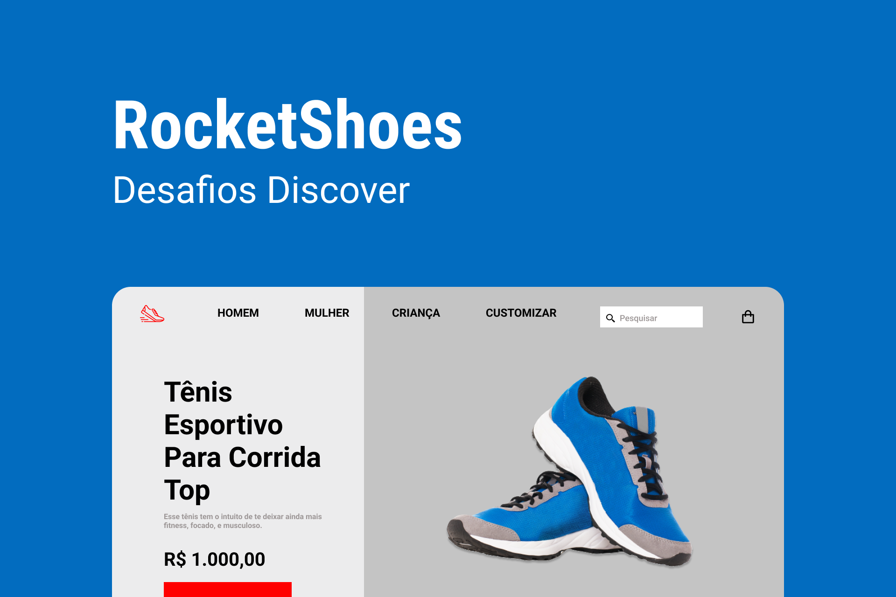

<h1 align="center">
  
</h1>

# ✅ **Requisitos**

---

Neste desafio o objetivo foi desenvolver um mini e-commerce de calçados esportivos

**Requisitos para o desafio:**

- Seguir o layout do Figma respeitando as medidas.
- O ponteiro do mouse deverá ter o comportamento de click nos **menus, footer** e nos **botões** da página.
- Adicionar um vídeo do youtube no local da imagem que representa um video.
- Deverá ter uma linha indicativa na foto que está aparecendo maximizada na galeria.

**_Se desafie também:_**

- Deixando o layout responsivo

**_Extras:_**

- Ícone para expandir e retrair o menu de navegação em dispositivos menores.
- A imagem maximizada muda a cada clique na imagem do tênis da galeria.

# 🎨 Style Guide

---

## **Cores:**

```css
:root {
  --button: #ff0000;
  --main-background: #c4c4c4;
  --background: #e5e5e5;
  --text: #000;
  --footer: #000;
  --text-description: #9c9696;
}
```

## **Tipo de fonte:**

font-family: Roboto

font Weight: 400 e 700

Você pode encontrar a fonte no [Google Fonts](https://fonts.google.com/)

O template do projeto se encontra no [figma](https://www.figma.com/file/iSQh5XZbkiiEDee3mHnhl4/DD-%2F-RocketShoes/duplicate).
